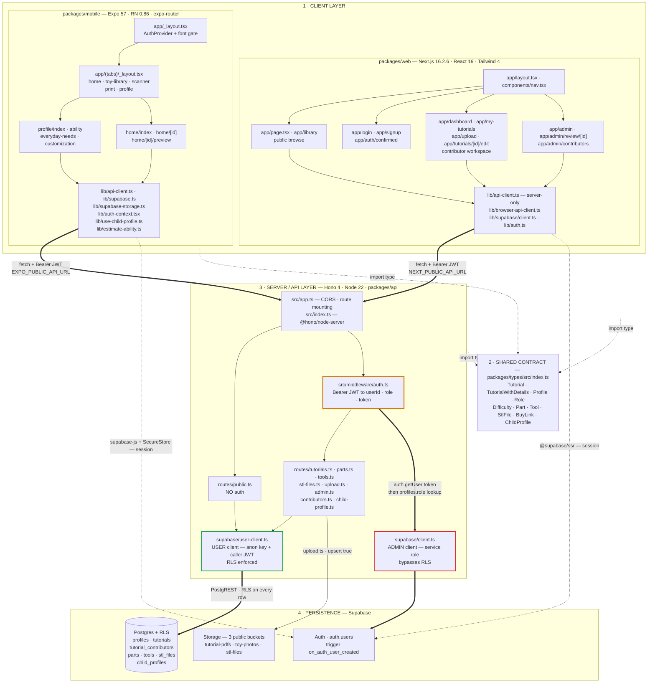
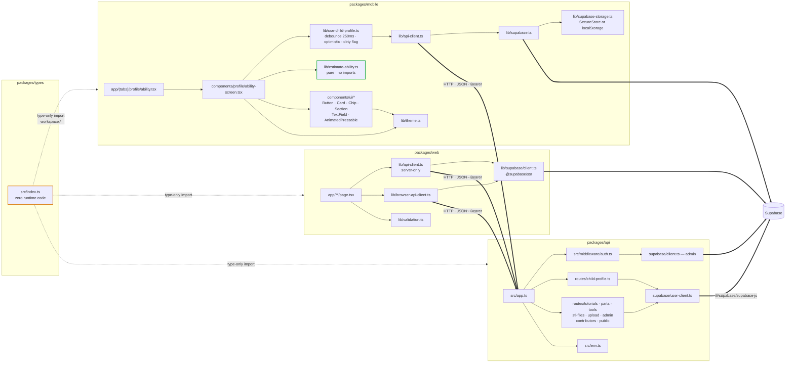
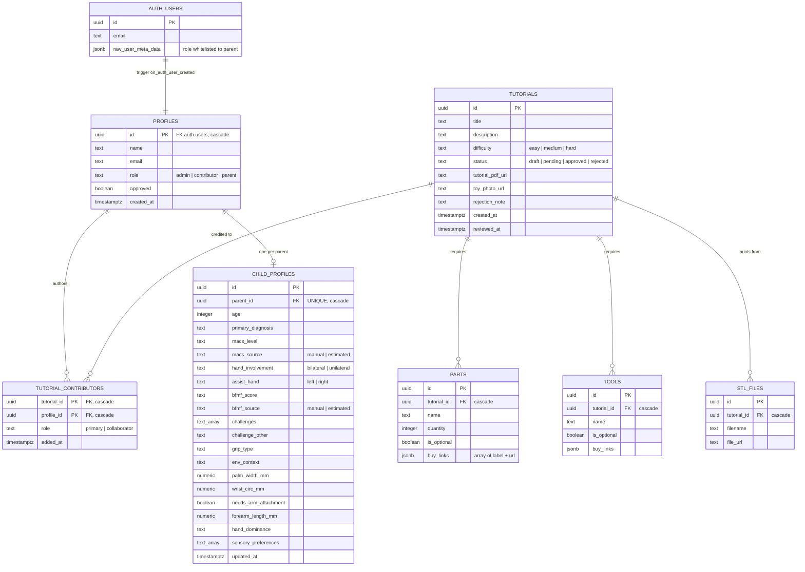
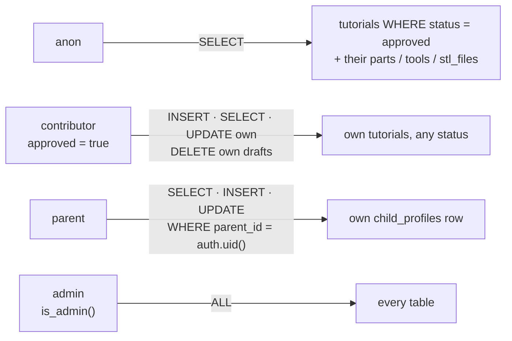
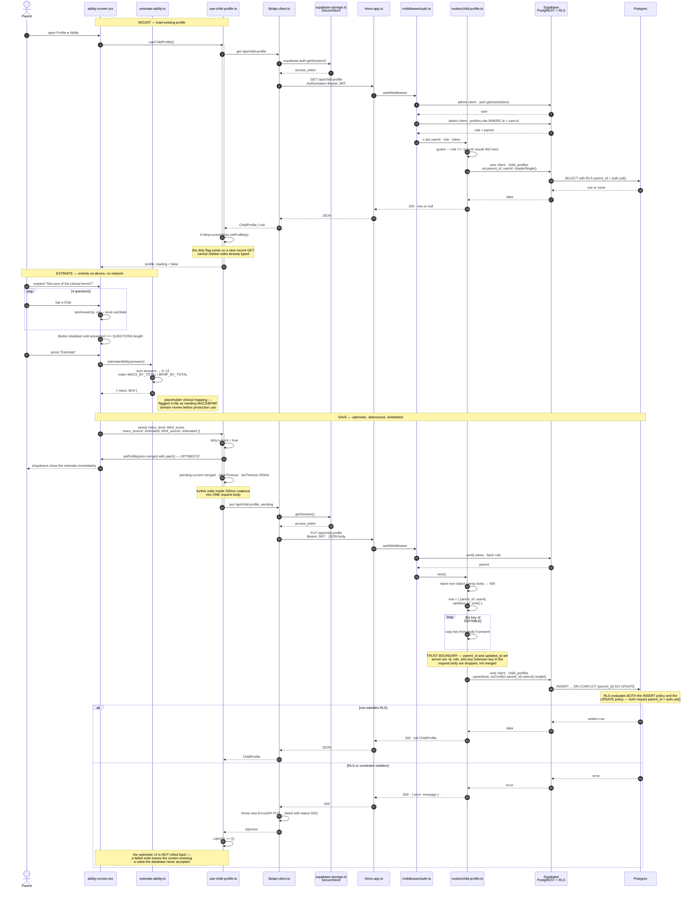
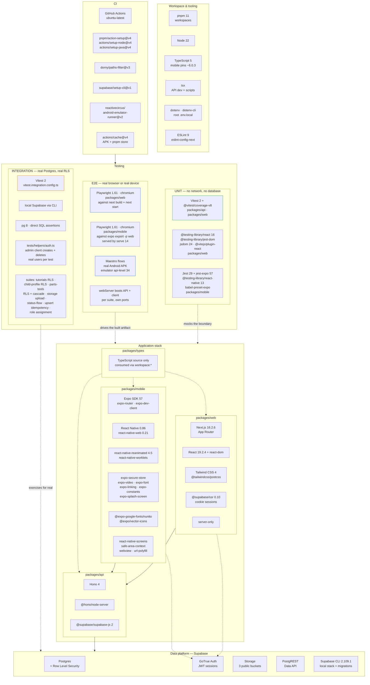

# SPLAT Connect — Architecture

**S**upporting **P**lay by **A**dapting **T**oys. Diagrams below are traced from the source in
`packages/`, `supabase/migrations/`, and `.github/workflows/ci.yml` — not from the summary in the
README.

**Layers as declared:**

| Layer | Stack | Location |
|---|---|---|
| Client — web | Next.js 16.2.6, React 19.2.4, Tailwind 4 | `packages/web` |
| Client — mobile | Expo 57, React Native 0.86, expo-router | `packages/mobile` |
| Shared contract | TypeScript types, no runtime code | `packages/types` |
| Server / API | Hono 4 on Node 22, `@hono/node-server` | `packages/api` |
| Persistence | Supabase — Postgres + RLS, Auth, Storage | `supabase/migrations` |
| CI | GitHub Actions, local Supabase per job | `.github/workflows/ci.yml` |

The architectural fact that shapes every diagram below: **the API never trusts its own privileges to
answer a user's question.** `middleware/auth.ts` uses a service-role admin client purely to *verify*
the JWT, then every route re-issues a second client bound to that same user JWT
(`supabase/user-client.ts`) so Postgres RLS — not application code — decides which rows come back.
Authorization lives in `001_schema.sql` and `003_ability_profile.sql`, not in the route handlers.

---

## 1. Layered Architecture

The two Supabase clients are the load-bearing distinction. `createAdminClient()` holds
`SUPABASE_SERVICE_ROLE_KEY` and ignores RLS entirely — it is reached from exactly one place in a
request path, `authMiddleware`, to answer "is this token real, and what role does it carry?"
Everything that touches user data goes through `createUserClient(token)`, which forwards the caller's
JWT so `auth.uid()` resolves inside the policies. A route that reached for the admin client by
mistake would silently return every row in the table.

Note the asymmetry between clients: web has two API clients (`api-client.ts` is `server-only`,
`browser-api-client.ts` is for client components), while mobile has one, because every mobile screen
is a client component by definition.

---

## 2. Module Dependency Graph

`@splat-connect/types` is imported by all three packages but has no build step and no dependencies —
it is exported straight from `./src/index.ts` and consumed as TypeScript source through pnpm's
`workspace:*` link. That is why `pnpm -r typecheck` is a meaningful CI gate: it is the only place
where a contract break between mobile, web, and API is caught at all.

`lib/estimate-ability.ts` imports nothing. That is deliberate and it is what makes the clinical
mapping unit-testable in isolation (`tests/unit/lib/estimate-ability.test.ts`) without an Expo
runtime — worth preserving, given the file's own comment flags the mapping as a placeholder awaiting
domain review.

---

## 3. Persistence Model

Reconstructed from `supabase/migrations/001_schema.sql` and `003_ability_profile.sql`.

Every relationship here is a real declared foreign key with `on delete cascade` — deleting a
`tutorials` row takes its parts, tools, STL files, and contributor links with it, and deleting an
`auth.users` row takes the whole profile subtree.

Two constraints carry design intent rather than just integrity:

- `child_profiles.parent_id` is **unique but not the primary key**. Multi-child support is one
  `drop constraint` away, and until then the unique index is what makes
  `upsert(row, { onConflict: 'parent_id' })` in `routes/child-profile.ts` a safe idempotent write.
- `tutorials` RLS splits `USING` from `WITH CHECK`: contributors may *read and edit* their own
  tutorials at any status, but `WITH CHECK` restricts the resulting status to
  `draft | pending | rejected`. Self-approval is structurally impossible, not merely unimplemented.

Row access is summarized below; the policies themselves live in `supabase/SCHEMA.md`.

---

## 4. Primary Data Flow — mobile Ability Profile

`/get`-scale end-to-end flows exist for every screen; this traces **one**: a parent opening the
Ability tab, answering the four screening questions, and having an estimated MACS/BFMF written back.
It is the flow that touches the most layers — local pure logic, optimistic UI, debounced write,
JWT minting from device storage, dual-client auth, a column whitelist, and RLS.

Three properties of this flow are worth stating plainly because they are decisions, not accidents:

**The debounce and the dirty flag solve opposite races.** The 250 ms timer coalesces a burst of
dropdown changes into one `PUT`; the `dirty` ref stops the mount-time `GET` from overwriting those
same changes if it resolves late. Removing either one reintroduces a distinct bug.

**The `EDITABLE` array is the trust boundary.** `routes/child-profile.ts` builds the upsert row by
copying *from* a whitelist rather than spreading the request body and deleting keys. A client that
sends `{ parent_id: "<someone else's uuid>" }` has that key ignored at the API — and even if the API
missed it, the RLS `WITH CHECK (parent_id = auth.uid())` would reject the write. Two independent
layers, which is the correct number for a row-ownership rule.

**Failure is silent by design gap, not by choice.** `apiClient` builds a genuinely useful error
message (method, path, status, and the server's `error` field), and then `use-child-profile.ts`
swallows it with `.catch(() => {})`. The optimistic state stays. For a form that autosaves without a
visible save button, the parent has no way to learn that their child's ability data did not persist.
That is the one gap in this flow worth closing first — a `failed` flag alongside `profile` and
`loading` would surface it without changing the request path at all.

---

## 5. CI Pipeline

From `.github/workflows/ci.yml`. There is no CD workflow in this repository — CI is the whole
pipeline.

```mermaid
flowchart TB
    subgraph TRIG["Triggers"]
        T1["push → main only"]
        T2["pull_request — any branch"]
        T3["workflow_dispatch"]
    end

    CC["concurrency group = workflow + ref<br/>cancel-in-progress UNLESS ref is main"]
    T1 & T2 & T3 --> CC

    CC --> CH["changes · Detect Changed Packages<br/>dorny/paths-filter@v3"]
    CC --> CK["check · Type Check<br/>pnpm -r typecheck"]
    CC --> TE["test · Unit Tests<br/>api → web → mobile, sequential"]

    CH -.->|"outputs: api · web · mobile<br/>shared paths set ALL THREE:<br/>packages/api, packages/types,<br/>supabase, ci.yml, lockfile,<br/>workspace, root package.json"| GATE{{"per-package gates"}}

    CK --> GATE
    TE --> GATE

    GATE -->|"if changes.api"| IT["integration · Integration Tests"]
    GATE -->|"if changes.mobile"| ME["mobile-e2e · Mobile E2E"]
    GATE -->|"if changes.web"| WE["web-e2e · Web E2E"]

    CK --> DE
    TE --> DE["device-e2e · Device E2E Android<br/>if ref == main OR workflow_dispatch<br/>NOTE: does not need 'changes'"]

    subgraph IT2["integration — ubuntu-latest"]
        I1["supabase/setup-cli pinned 2.109.1"]
        I2["sysctl reserve ports 54320-54329<br/>they sit inside the ephemeral range"]
        I3["supabase start"]
        I4["vitest -c vitest.integration.config.ts"]
        I5["supabase stop · if always()"]
        I1 --> I2 --> I3 --> I4 --> I5
    end

    subgraph ME2["mobile-e2e — ubuntu-latest"]
        M1["supabase start"]
        M2["playwright install chromium"]
        M3["playwright test<br/>webServer boots API :3102<br/>+ expo export -p web served on :3103"]
        M4["supabase stop"]
        M1 --> M2 --> M3 --> M4
    end

    subgraph WE2["web-e2e — ubuntu-latest"]
        W1["supabase start"]
        W2["playwright install chromium"]
        W3["playwright test<br/>webServer boots API :3104<br/>+ next build && next start on :3105"]
        W4["supabase stop"]
        W1 --> W2 --> W3 --> W4
    end

    subgraph DE2["device-e2e — ubuntu-latest"]
        D1["setup-java 17 temurin"]
        D2["actions/cache — app-release.apk<br/>key hashes app.json, package.json,<br/>lockfile, ci.yml, app/, components/,<br/>lib/, assets/, packages/types"]
        D3["expo prebuild --clean<br/>+ gradlew assembleRelease<br/>skipped on cache hit"]
        D4["supabase start · reserve ports"]
        D5["start API on :3106<br/>curl retry loop, 60 × 2s"]
        D6["device:fixture → GITHUB_ENV<br/>--silent is load-bearing"]
        D7["assert bundle baked 10.0.2.2<br/>and NOT localhost:54321<br/>Hermes bytecode → grep -a, piped"]
        D8["install Maestro"]
        D9["android-emulator-runner@v2<br/>api-level 34 · pixel_6 · x86_64<br/>adb install + maestro test"]
        D10["upload maestro-debug · if failure()"]
        D1 --> D2 --> D3 --> D4 --> D5 --> D6 --> D7 --> D8 --> D9 --> D10
    end

    IT --> IT2
    ME --> ME2
    WE --> WE2
    DE --> DE2

    style CH stroke:#16a34a,stroke-width:2px
    style DE stroke:#d97706,stroke-width:2px
    style D7 stroke:#16a34a,stroke-width:2px
```

Every gated job boots its own local Supabase, which is roughly two minutes of Docker before a single
assertion runs. That cost is why `changes` exists at all: a mobile-only PR skips `integration` and
`web-e2e` entirely. The filter deliberately over-triggers on shared paths — a change to
`packages/api`, `packages/types`, `supabase/`, the lockfile, or `ci.yml` itself sets all three
outputs, because any of those can break any client.

`device-e2e` is the deliberate exception to the whole shape of this pipeline. It depends on `check`
and `test` but **not** on `changes`, and it runs only on `main` or manual dispatch, so it never gates
a PR. It is also the only job that covers `lib/supabase-storage.ts`'s SecureStore branch: the
Playwright mobile suite runs the Expo *web* export, where `resolveAuthStorage` returns the
localStorage adapter, so no Playwright test can reach the native path. Paying emulator time on every
PR to cover one branch would cost more than it saves; paying it on every merge to `main` does not.

The bundle-host assertion (`D7`) is the interesting guard. Because `EXPO_PUBLIC_*` values are *baked
into* the JS bundle at export time rather than read at runtime, a stale Metro cache can freeze a
`localhost` URL into an APK that then fails on the emulator as an inscrutable timeout. Asserting
against the built artifact rather than the environment means the check still holds on a cache hit.

---

## 6. Technology Stack

Everything the repository actually depends on, grouped by the job it does. Test tooling is split by
tier because the three tiers do not share a runner.

The split worth internalizing is **what each tier is allowed to touch**:

| Tier | Runner | Database | Auth | What it proves |
|---|---|---|---|---|
| Unit | Vitest (api, web) / Jest + jest-expo (mobile) | none — mocked | mocked | Pure logic and component rendering. `estimateAbility`, `resolveAuthStorage`, screen states. |
| Integration | Vitest against local Supabase | **real Postgres** | **real users**, created and deleted per test | That the RLS policies actually do what `SCHEMA.md` claims — the assertions that cannot be mocked without asserting the mock. |
| E2E (web) | Playwright + chromium | real, local | real | The Next.js **production build**, not the dev server, wired to a real API. |
| E2E (mobile) | Playwright + chromium against `expo export -p web` | real, local | real | Every screen and navigation flow — but on the react-native-web target. |
| E2E (device) | Maestro on an Android emulator, release APK | real, local | real | The native-only paths, chiefly expo-secure-store session persistence across a cold start. |

Mobile is the only package with three test tiers pointed at it, and that is a direct consequence of
the Expo-web trick: running the mobile suite in a browser makes it fast and cheap enough to gate
every PR, at the cost of a coverage hole that only a real device closes. The Maestro flows exist
precisely to fill that hole and are scoped to it — `session-survives-cold-start` and
`sign-out-clears-session`, nothing more.

Port allocation follows from running these suites alongside a dev stack:

| Purpose | Web | API | Other |
|---|---|---|---|
| Local dev | 3100 | 3101 | Metro 8081 |
| Mobile E2E | 3103 | 3102 | — |
| Web E2E | 3105 | 3104 | — |
| Device E2E | — | 3106 | emulator reaches host as `10.0.2.2` |
| Supabase local | — | — | 54321 API, 54322 Postgres |

The ranges do not overlap on purpose: Playwright's `reuseExistingServer` would otherwise silently
hand a suite your running dev API, and a passing run would mean nothing.
