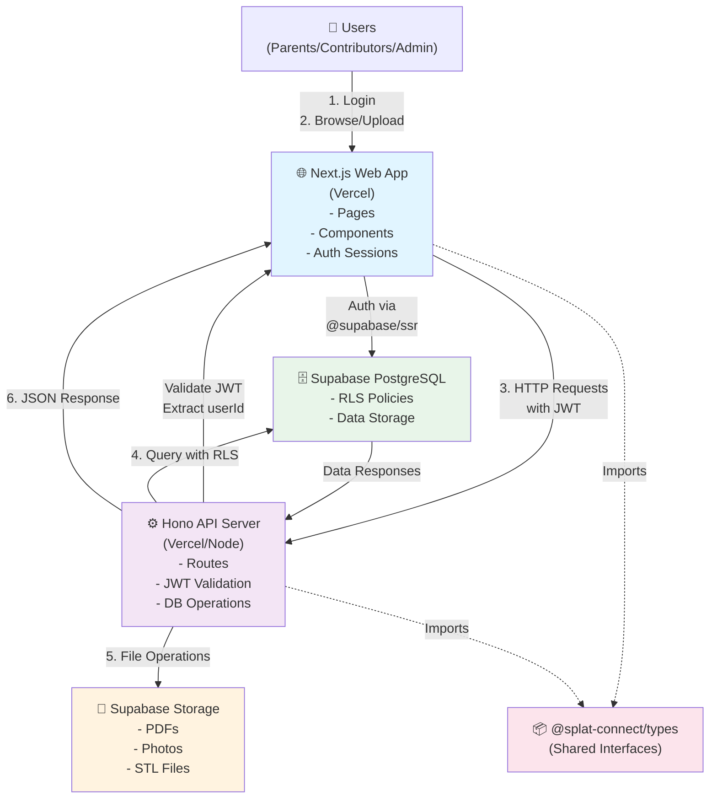
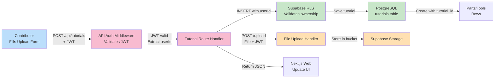

# SPLAT Connect

**Supporting Play by Adapting Toys** — A web platform that helps children with disabilities access play by making toy adaptation knowledge discoverable and shareable.

> SPLAT Connect is a free, open platform for parents and contributors to explore, share, and discover toy adaptation tutorials for inclusive play.

---

## 📋 Table of Contents

1. [Overview](#overview)
2. [Architecture](#architecture)
3. [Project Structure](#project-structure)
4. [Technology Stack](#technology-stack)
5. [File Guide](#file-guide)
6. [Setup & Development](#setup--development)
7. [Scripts & Commands](#scripts--commands)
8. [Testing](#testing)
9. [Database Schema](#database-schema)
10. [Deployment](#deployment)

---

## 🎯 Overview

SPLAT Connect is a three-tiered platform serving:

- **Parents & Guardians**: Browse a searchable library of toy adaptation tutorials
- **Contributors**: Create, upload, and submit toy adaptation tutorials for review
- **Administrators**: Review submissions, approve tutorials, manage the platform

### Key Features

- 📚 **Central Library**: Searchable database of toy adaptation tutorials
- 👥 **Contributor Submissions**: Community-driven content creation with approval workflow
- 🔐 **Row-Level Security**: Ensures users only see data they're authorized to access
- ⚡ **Serverless-Ready**: Designed to run on free tiers (Vercel + Supabase)
- 📱 **Responsive Design**: Mobile-first UI built with Next.js and Tailwind CSS
- 🗄️ **TypeScript**: Full type safety across frontend, backend, and shared types

---

## 🏗️ Architecture

### System Architecture



### Data Flow: Tutorial Upload



---

## 📁 Project Structure

```
splat-connect/                          ← Workspace root
│
├── pnpm-workspace.yaml                 ← Declares all workspaces
├── pnpm-lock.yaml                      ← Lock file for dependency versions
├── package.json                        ← Root workspace scripts
├── next-env.d.ts                       ← Next.js type definitions
├── README.md                           ← This file
│
├── packages/                           ← Monorepo packages (managed by pnpm)
│   │
│   ├── types/                          ← Shared TypeScript interfaces
│   │   ├── package.json
│   │   ├── tsconfig.json
│   │   └── src/
│   │       ├── index.ts                ← Main export file
│   │       ├── models.ts               ← Domain interfaces (Profile, Tutorial, etc.)
│   │       └── enums.ts                ← Enums (Role, Status, Difficulty)
│   │
│   ├── api/                            ← Hono HTTP server (all DB operations)
│   │   ├── package.json
│   │   ├── tsconfig.json
│   │   ├── vitest.config.ts            ← Test configuration
│   │   ├── .env.example                ← Environment variable template
│   │   ├── src/
│   │   │   ├── index.ts                ← Entry point, server setup, route mounting
│   │   │   ├── config.ts               ← Configuration (PORT, CORS_ORIGIN, etc.)
│   │   │   ├── middleware/
│   │   │   │   └── auth.ts             ← JWT validation, context attachment
│   │   │   ├── routes/
│   │   │   │   ├── public.ts           ← GET /public/tutorials (unauthenticated)
│   │   │   │   ├── tutorials.ts        ← CRUD /tutorials endpoints
│   │   │   │   ├── upload.ts           ← POST /upload (file uploads)
│   │   │   │   ├── parts.ts            ← POST/DELETE parts endpoints
│   │   │   │   ├── tools.ts            ← POST/DELETE tools endpoints
│   │   │   │   ├── stl-files.ts        ← POST/DELETE 3D model files
│   │   │   │   ├── admin.ts            ← GET/PATCH admin review endpoints
│   │   │   │   └── contributors.ts     ← GET/PATCH contributor profile
│   │   │   └── supabase/
│   │   │       ├── client.ts           ← Admin Supabase client (service role)
│   │   │       └── user-client.ts      ← RLS-respecting client from JWT
│   │   ├── tests/
│   │   │   ├── unit/
│   │   │   │   ├── routes.test.ts      ← Route handler tests (mocked)
│   │   │   │   └── middleware.test.ts  ← Auth middleware tests
│   │   │   └── integration/
│   │   │       └── tutorials.test.ts   ← Tests against real local Supabase
│   │   └── dist/                       ← Compiled output (after build)
│   │
│   └── web/                            ← Next.js web application (UI layer)
│       ├── package.json
│       ├── tsconfig.json
│       ├── next.config.ts              ← Next.js config (image optimization)
│       ├── eslint.config.mjs           ← ESLint rules
│       ├── vitest.config.ts            ← Unit test configuration
│       ├── playwright.config.ts        ← E2E test configuration
│       ├── postcss.config.mjs          ← Tailwind CSS processor
│       ├── middleware.ts               ← Auth session validation (per-route)
│       ├── next-env.d.ts               ← Next.js type definitions
│       ├── app/
│       │   ├── layout.tsx              ← Root layout, nav bar
│       │   ├── page.tsx                ← Home/landing page
│       │   ├── login/                  ← Login page
│       │   ├── signup/                 ← Signup page
│       │   ├── pending/                ← "Awaiting approval" page
│       │   ├── library/                ← Browse approved tutorials
│       │   ├── tutorials/
│       │   │   └── [id]/               ← Tutorial detail page
│       │   ├── dashboard/              ← Contributor dashboard
│       │   ├── my-tutorials/           ← My tutorials list
│       │   ├── upload/                 ← 6-step upload form
│       │   └── admin/                  ← Admin dashboard (if admin user)
│       ├── components/
│       │   ├── nav.tsx                 ← Navigation bar
│       │   ├── tutorial-card.tsx       ← Tutorial preview card
│       │   ├── difficulty-badge.tsx    ← Difficulty level badge
│       │   ├── file-drop-zone.tsx      ← Drag-and-drop file input
│       │   └── buy-links-input.tsx     ← Material links form
│       ├── lib/
│       │   ├── api-client.ts           ← HTTP client for API calls
│       │   ├── supabase.ts             ← Supabase client setup (@supabase/ssr)
│       │   └── utils.ts                ← Helper functions
│       ├── public/                     ← Static assets
│       ├── tests/
│       │   ├── unit/
│       │   │   └── components.test.tsx ← Component unit tests
│       │   └── e2e/
│       │       └── workflow.spec.ts    ← E2E tests (full user flows)
│       └── coverage/                   ← Test coverage reports
│
├── supabase/                           ← Database configuration (shared by all packages)
│   ├── migrations/
│   │   ├── 001_initial.sql             ← Core schema (tables, indexes, RLS)
│   │   ├── 002_parts_tools_schema.sql  ← Parts and tools tables
│   │   ├── 003_fix_rls_recursion.sql   ← Fix RLS policy issues
│   │   └── 004_fix_tutorial_submit_policy.sql ← Additional RLS fixes
│   └── seed.sql                        ← Deterministic seed data for dev/testing
│
└── docs/
    └── superpowers/
        ├── plans/
        │   ├── 2026-05-26-monorepo-refactor.md      ← Architecture decisions
        │   └── 2026-05-26-comprehensive-testing.md  ← Testing strategy
        └── specs/
            ├── 2026-05-25-splat-connect-library-design.md
            ├── 2026-05-25-contributor-dashboard-design.md
            └── 2026-05-26-monorepo-architecture-testing-design.md
```

---

## 🛠️ Technology Stack

| Category | Technology | Purpose |
|----------|-----------|---------|
| **Monorepo** | pnpm workspaces | Dependency management & package linking |
| **API Server** | Hono v4 + @hono/node-server | Lightweight HTTP server, all DB operations |
| **Frontend** | Next.js 16+ | React-based UI, server-side rendering |
| **Database** | PostgreSQL (Supabase) | Relational data with RLS enforcement |
| **File Storage** | Supabase Storage | PDFs, photos, STL models |
| **Authentication** | Supabase Auth + @supabase/ssr | JWT-based auth, secure cookies |
| **Language** | TypeScript 5 | End-to-end type safety |
| **Styling** | Tailwind CSS 4 | Utility-first CSS framework |
| **Testing** | Vitest + Playwright + RTL | Unit, integration, and E2E tests |
| **Linting** | ESLint | Code quality |
| **Image Optimization** | Next.js Image | Auto-optimization from Supabase URLs |
| **Runtime** | Node.js 20+ | Server runtime |
| **Deployment** | Vercel + Supabase | Serverless frontend & backend |

---

## � Understanding the Codebase

**All source files now include detailed comments** explaining:
- What the file does
- How it interacts with other files  
- Key data flows and workflows

**To understand any file**, open it and read the file-level comment at the top. Key files to start with:

### Core Files to Understand

**Data Model:**
- [packages/types/src/index.ts](packages/types/src/index.ts) — Comprehensive overview of all types and how they interact

**API (Backend):**
- [packages/api/src/index.ts](packages/api/src/index.ts) — HTTP server setup and routing
- [packages/api/src/middleware/auth.ts](packages/api/src/middleware/auth.ts) — JWT validation and context setup
- [packages/api/src/supabase/user-client.ts](packages/api/src/supabase/user-client.ts) — RLS-respecting database access
- [packages/api/src/routes/tutorials.ts](packages/api/src/routes/tutorials.ts) — Tutorial CRUD operations

**Web (Frontend):**
- [packages/web/app/layout.tsx](packages/web/app/layout.tsx) — Root layout and navigation setup
- [packages/web/middleware.ts](packages/web/middleware.ts) — Route protection and auth validation
- [packages/web/lib/api-client.ts](packages/web/lib/api-client.ts) — Server-side API communication

**Key Workflows:**
- [packages/web/app/upload/page.tsx](packages/web/app/upload/page.tsx) — Multi-step tutorial creation
- [packages/web/app/admin/page.tsx](packages/web/app/admin/page.tsx) — Admin dashboard
- [packages/web/app/login/page.tsx](packages/web/app/login/page.tsx) — Authentication flow

### File Listing

All source files include detailed comments. Here's the full structure:

**packages/api/**
- `src/index.ts` — Server entry point
- `src/middleware/auth.ts` — JWT validation
- `src/routes/public.ts` — Public tutorial browsing
- `src/routes/tutorials.ts` — Tutorial CRUD
- `src/routes/upload.ts` — File uploads
- `src/routes/parts.ts`, `tools.ts`, `stl-files.ts` — Sub-resources
- `src/routes/admin.ts` — Admin operations
- `src/routes/contributors.ts` — User profiles
- `src/supabase/client.ts` — Admin client (bypasses RLS)
- `src/supabase/user-client.ts` — User client (enforces RLS)

**packages/web/**
- `app/layout.tsx` — Root layout
- `app/page.tsx` — Home/landing
- `app/login/page.tsx` — Login
- `app/library/page.tsx` — Public tutorial browse
- `app/dashboard/page.tsx` — Contributor hub
- `app/upload/page.tsx` — Create tutorial (6-step wizard)
- `app/admin/page.tsx` — Admin dashboard
- `middleware.ts` — Route protection
- `lib/api-client.ts` — Server-side API calls
- `lib/browser-api-client.ts` — Client-side API calls
- `lib/validation.ts` — Form validation
- `components/*.tsx` — UI components

**packages/types/**
- `src/index.ts` — All type definitions and data model documentation

---

## 🚀 Setup & Development

### Prerequisites

- **Node.js** 20.x or higher
- **pnpm** 9.x or higher ([install pnpm](https://pnpm.io/installation))
- **Supabase CLI** (for local development) — optional but recommended
- **Docker** (for local Supabase) — optional

### 1. Clone and Install

```bash
# Clone the repository
git clone https://github.com/yourusername/splat-connect.git
cd splat-connect

# Install dependencies for all packages
pnpm install
```

### 2. Configure Environment Variables

```bash
# Copy API environment template
cp packages/api/.env.example packages/api/.env.local

# Edit .env.local with your Supabase credentials
nano packages/api/.env.local
```

**Required Variables** (in `packages/api/.env.local`):
```env
PORT=3001
CORS_ORIGIN=http://localhost:3000

SUPABASE_URL=https://your-project.supabase.co
SUPABASE_ANON_KEY=your-anon-public-key
SUPABASE_SERVICE_ROLE_KEY=your-service-role-key
```

Get these from [Supabase Dashboard](https://app.supabase.com) → Settings → API.

### 3. Start Development Servers

**Option A: Run both in separate terminals**

```bash
# Terminal 1: Start API server (port 3001)
cd packages/api
pnpm dev

# Terminal 2: Start Next.js (port 3000)
cd packages/web
pnpm dev
```

**Option B: Use workspace scripts** (if using aliases)

```bash
# From root directory
pnpm dev:api  # Terminal 1
pnpm dev:web  # Terminal 2
```

Open http://localhost:3000 in your browser.

### 4. (Optional) Set Up Local Supabase

For integration testing with real Supabase instance:

```bash
# Install Supabase CLI
npm install -g supabase

# Start local Supabase (requires Docker)
supabase start

# This creates a local PostgreSQL instance on port 54322
# Get credentials from the output and update .env.local
```

---

## 📋 Scripts & Commands

### Workspace-Level Scripts (run from root)

```bash
pnpm install              # Install dependencies for all packages
pnpm dev:api              # Start API server on port 3001
pnpm dev:web              # Start Next.js on port 3000
pnpm build                # Build all packages for production
pnpm typecheck            # Run TypeScript type checking
pnpm -r test              # Run all tests in all packages
```

### API Package Scripts

```bash
cd packages/api

pnpm dev                  # Start API with file watching
pnpm build                # Compile TypeScript to dist/
pnpm start                # Run compiled server (production)
pnpm typecheck            # Type check without emit
pnpm test:unit            # Unit tests (mocked Supabase)
pnpm test:integration     # Integration tests (local Supabase)
pnpm test                 # All tests with coverage
pnpm test:cleanup         # Clean up test data from Supabase
```

### Web Package Scripts

```bash
cd packages/web

pnpm dev                  # Start Next.js dev server
pnpm build                # Build for production
pnpm start                # Serve production build
pnpm typecheck            # Type check without emit
pnpm lint                 # Run ESLint
pnpm test:unit            # Unit tests (Vitest + RTL)
pnpm test:e2e             # E2E tests (Playwright, opens browser)
pnpm test:e2e:ui          # E2E tests with interactive browser
```

### Types Package Scripts

```bash
cd packages/types

pnpm typecheck            # Type check exports
```

---

## 🧪 Testing

### Unit Tests

Test individual functions and components without network calls.

```bash
# API unit tests (mocked Supabase)
cd packages/api
pnpm test:unit

# Web unit tests (mocked API)
cd packages/web
pnpm test:unit

# All unit tests
pnpm -r test:unit
```

**Test files**:
- `packages/api/tests/unit/*.test.ts` — Route handlers, middleware
- `packages/web/tests/unit/*.test.tsx` — Components, utilities

### Integration Tests

Test API routes against a **real local Supabase** with actual RLS policies enforced.

```bash
# Start local Supabase first
supabase start

# Run integration tests
cd packages/api
pnpm test:integration

# Clean up test data afterward
pnpm test:cleanup
```

**Test files**:
- `packages/api/tests/integration/*.test.ts` — Full database operations

### E2E Tests

Test complete user workflows through the UI using Playwright.

```bash
# Make sure both API and web servers are running
pnpm dev:api  # Terminal 1
pnpm dev:web  # Terminal 2

# Run E2E tests (headless)
cd packages/web
pnpm test:e2e

# Or open interactive browser
pnpm test:e2e:ui
```

**Test files**:
- `packages/web/tests/e2e/*.spec.ts` — Full user workflows

### Coverage

Generate and view test coverage reports.

```bash
# Generate coverage
pnpm test                 # All tests with coverage
pnpm -r test              # By package

# View coverage report (HTML)
open packages/api/coverage/index.html
open packages/web/coverage/index.html
```

---

## 🗄️ Database Schema

### Tables Overview

| Table | Purpose | Key Columns |
|-------|---------|-------------|
| `profiles` | User profiles (extends `auth.users`) | `id`, `name`, `email`, `role` (admin\|contributor), `approved`, `created_at` |
| `tutorials` | Toy adaptation tutorials | `id`, `title`, `description`, `difficulty`, `status` (draft\|pending\|approved\|rejected), `tutorial_pdf_url`, `toy_photo_url`, `created_at` |
| `tutorial_contributors` | Many-to-many: contributors per tutorial | `tutorial_id`, `profile_id`, `role` (primary\|collaborator), `added_at` |
| `parts` | Materials needed for a tutorial | `id`, `tutorial_id`, `name`, `quantity`, `is_optional`, `buy_links` (JSONB) |
| `tools` | Tools needed for a tutorial | `id`, `tutorial_id`, `name`, `is_optional`, `buy_links` (JSONB) |
| `stl_files` | 3D model files for a tutorial | `id`, `tutorial_id`, `filename`, `file_url` |

### Row Level Security (RLS) Policies

All tables have RLS enabled. Policies enforce:

- **Public reads**: Anyone can `SELECT` approved tutorials and related data
- **Contributor access**: Contributors can only read/write their own tutorials (draft/rejected)
- **Admin access**: Admins can read/write all data
- **Cascade deletes**: Deleting a tutorial cascades to parts, tools, files, contributors

**Example policy** (on `tutorials` table):
```sql
-- Public can read approved tutorials
CREATE POLICY "public_read_approved" ON tutorials
  FOR SELECT TO public
  USING (status = 'approved');

-- Contributors can read their own (any status)
CREATE POLICY "contributors_read_own" ON tutorials
  FOR SELECT TO authenticated
  USING (
    auth.uid() = user_id 
    OR auth.jwt() ->> 'role' = 'admin'
  );
```

### Migrations

Database schema is versioned in `supabase/migrations/`:

| File | Purpose |
|------|---------|
| [001_initial.sql](supabase/migrations/001_initial.sql) | Core schema (tables, indexes, RLS) |
| [002_parts_tools_schema.sql](supabase/migrations/002_parts_tools_schema.sql) | Parts and tools tables |
| [003_fix_rls_recursion.sql](supabase/migrations/003_fix_rls_recursion.sql) | Fix RLS policy conflicts |
| [004_fix_tutorial_submit_policy.sql](supabase/migrations/004_fix_tutorial_submit_policy.sql) | Additional RLS fixes |

Run migrations with:
```bash
supabase db push  # Push to remote Supabase
supabase db pull  # Pull from remote and generate migrations
```

---

## 🌐 Deployment

### Frontend Deployment (Vercel)

1. Connect your GitHub repository to [Vercel](https://vercel.com)
2. Vercel auto-detects Next.js monorepo structure
3. Set root directory to `packages/web`
4. Deployment is automatic on `main` branch push

### API Deployment (Vercel or Node)

**Option A: Deploy to Vercel Functions**

```bash
# Vercel auto-builds and deploys Hono server
# Deploy with: vercel deploy
```

**Option B: Deploy to Node.js Server**

```bash
# Build API
cd packages/api
pnpm build

# Deploy dist/ folder
# Run: node dist/index.js
```

### Environment Variables

Set these in your deployment platform:

| Variable | Value |
|----------|-------|
| `PORT` | `3001` (or platform-assigned) |
| `CORS_ORIGIN` | Your Vercel frontend URL |
| `SUPABASE_URL` | Your Supabase project URL |
| `SUPABASE_ANON_KEY` | Supabase public anon key |
| `SUPABASE_SERVICE_ROLE_KEY` | Supabase service role key |

### Database (Supabase)

Use Supabase's managed PostgreSQL:

1. Create project at [app.supabase.com](https://app.supabase.com)
2. Push migrations: `supabase db push`
3. Store credentials in API environment variables

---

## 📚 Architecture Decisions

See [docs/superpowers/plans/](docs/superpowers/plans/) for detailed design documents:

- [2026-05-26-monorepo-refactor.md](docs/superpowers/plans/2026-05-26-monorepo-refactor.md) — Monorepo structure, package separation
- [2026-05-26-comprehensive-testing.md](docs/superpowers/plans/2026-05-26-comprehensive-testing.md) — Testing strategy

---

## 🤝 Contributing

1. Create a feature branch: `git checkout -b feature/your-feature`
2. Make changes and commit: `git commit -am 'Add feature'`
3. Push branch: `git push origin feature/your-feature`
4. Open a pull request

### Code Style

```bash
# Type checking
pnpm typecheck

# Linting
pnpm lint

# Tests before submitting
pnpm test
```

---

## 📝 License

[Your License Here]

---

## 🎯 Key Design Principles

1. **Type Safety First**: TypeScript end-to-end, shared `types` package as single source of truth
2. **API Gateway Pattern**: All data operations go through API, never direct Supabase from web
3. **RLS Enforcement**: Database enforces access control, not application layer
4. **Separation of Concerns**: Types → API → Web, each layer has single responsibility
5. **Monorepo for Simplicity**: Shared types, unified scripts, easier refactoring
6. **Serverless-Ready**: Designed for Vercel + Supabase free tiers

---

**Last Updated**: May 27, 2026
